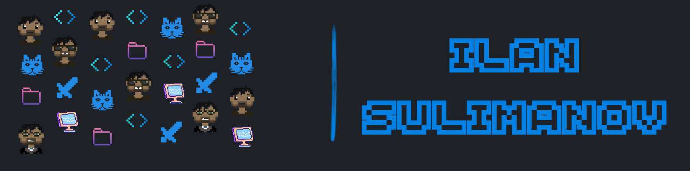

<h1 align="center">Hi 👋, I'm Ilan Sulimanov</h1>
<h3 align="center">A passionate Fullstack / Frontend developer from Israel</h3>

  

- 🔭 I’m currently working on [Fitty - It Will Fit You](https://github.com/Ilansuli/fitty)
  
- ✅ Check out my latest project [Satisfy](https://satisfy-0-2.onrender.com)

- 📫 How to reach me **ilansuli2147@gmail.com**

- 📄 Know about my experiences by my [CV](https://drive.google.com/file/d/1YCqcrWH3lVCTYLMTxU1itlIYB6CRCm4p/view?usp=drive_link)

<h3 align="left">Connect with me:</h3>

<h3 align="left">Languages and Tools:</h3>

                

